# AI 员工长期记忆方案设计

## 0. 需求主题

AI 员工的长期记忆设计。

本需求面向 NocoBase 内置 AI 员工，目标是在现有对话、工具、知识库、工作流和权限体系之上，补齐跨会话、可治理、可审计、可淘汰的长期记忆能力。

长期记忆需要服务于 NocoBase 的业务系统场景，而不是只服务于通用聊天：

- 在 CRM、ERP、项目管理、工单、审批、人事、数据分析等业务应用中，AI 员工能记住用户偏好、业务口径、任务背景和员工经验。
- 在低代码/无代码应用中，AI 员工记忆应和用户、角色、数据权限、工作流、知识库保持一致。
- 在不同规模公司中，长期记忆应能从“个人私有记忆”逐步扩展到“团队/员工/组织级记忆”，避免小公司配置过重，也避免大公司缺少治理。

## 1. 需求背景

本文先从模块和对象设计角度说明 AI 员工长期记忆方案，不展开到具体代码实现。重点回答两个问题：

- 当前 AI 员工是什么架构，已经有哪些能力，以及现有“记忆相关设计”到底覆盖到什么程度。
- 长期记忆应该如何建模、管理、存储、增加、更新、丢弃和使用。

核心结论：

- 当前 AI 员工已经具备“会话短期记忆”“运行状态恢复”和“知识库检索”，但还没有严格意义上的“跨会话、可治理、可审计、可淘汰”的长期记忆。
- 长期记忆不建议直接等同于聊天记录、知识库或 LangGraph checkpoint。更合理的做法是新增独立的 Memory 域模型：关系库保存可治理的记忆对象，向量索引用于语义召回，再通过统一的记忆管理器接入 AI 员工对话和工作流。

### 1.1 NocoBase 业务场景适配

长期记忆需要贴合 NocoBase 的核心业务特点：数据模型驱动、权限驱动、工作流驱动、插件化扩展。

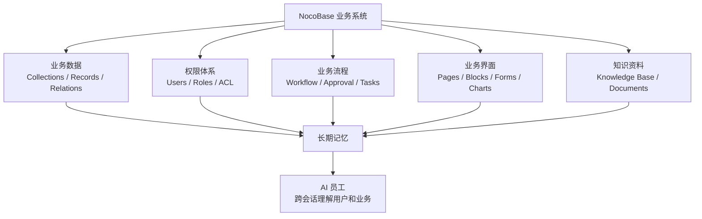

典型场景：

| 业务场景 | 长期记忆价值 |
| --- | --- |
| CRM 销售分析 | 记住客户分层口径、线索评分习惯、销售负责人关注指标 |
| 工单/客服 | 记住用户常见问题、处理偏好、升级规则和历史跟进背景 |
| 审批/流程 | 记住部门审批习惯、风险关注点、常用判断标准 |
| 数据分析 | 记住指标解释、图表偏好、常用筛选条件和业务口径 |
| 项目管理 | 记住项目背景、里程碑、团队约定和输出格式偏好 |
| 本地化/内容生产 | 记住术语、语气、翻译规范、品牌表达偏好 |

### 1.2 不同公司规模适配

长期记忆架构需要分层，才能适配从小团队到大型组织的不同治理复杂度。

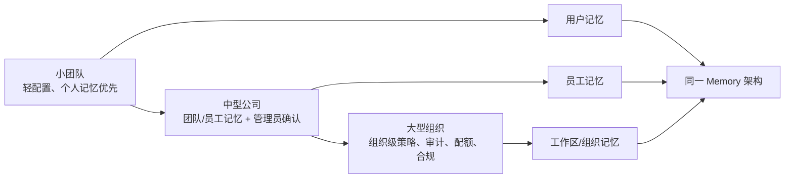

| 公司规模 | 推荐启用能力 | 设计侧重点 |
| --- | --- | --- |
| 小团队 / 单部门 | 用户私有记忆、手动保存、AI 建议保存 | 开箱即用、低配置、用户可控 |
| 中型公司 / 多团队 | 用户记忆 + 员工级记忆 + 管理员确认 | 团队协作、员工经验沉淀、权限边界 |
| 大型组织 / 多角色多业务线 | 用户/员工/组织多层记忆、审计、配额、保留策略 | 合规、隔离、治理、可追溯 |

因此，方案不能只设计一个简单的“聊天记忆表”，而要支持 scope、owner、permission、lifecycle、audit 等治理维度。

## 2. 方案调研

### 2.1 AI 员工现状

#### 2.1.1 当前架构设计

AI 员工位于 `plugin-ai` 中，向下依赖 NocoBase 的用户、权限、数据源、资源 API、工作流和文件能力，向外连接 LLM provider、MCP、知识库和向量存储。

为了避免把“模块归属”和“运行时调用顺序”混在一起，这里拆成两张图：

- 静态模块图：说明 AI 员工由哪些能力模块组成。
- 运行时调用图：说明一次请求里谁先调用谁。

静态模块图：

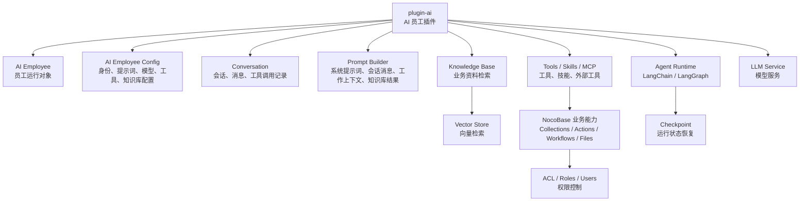

运行时调用图：

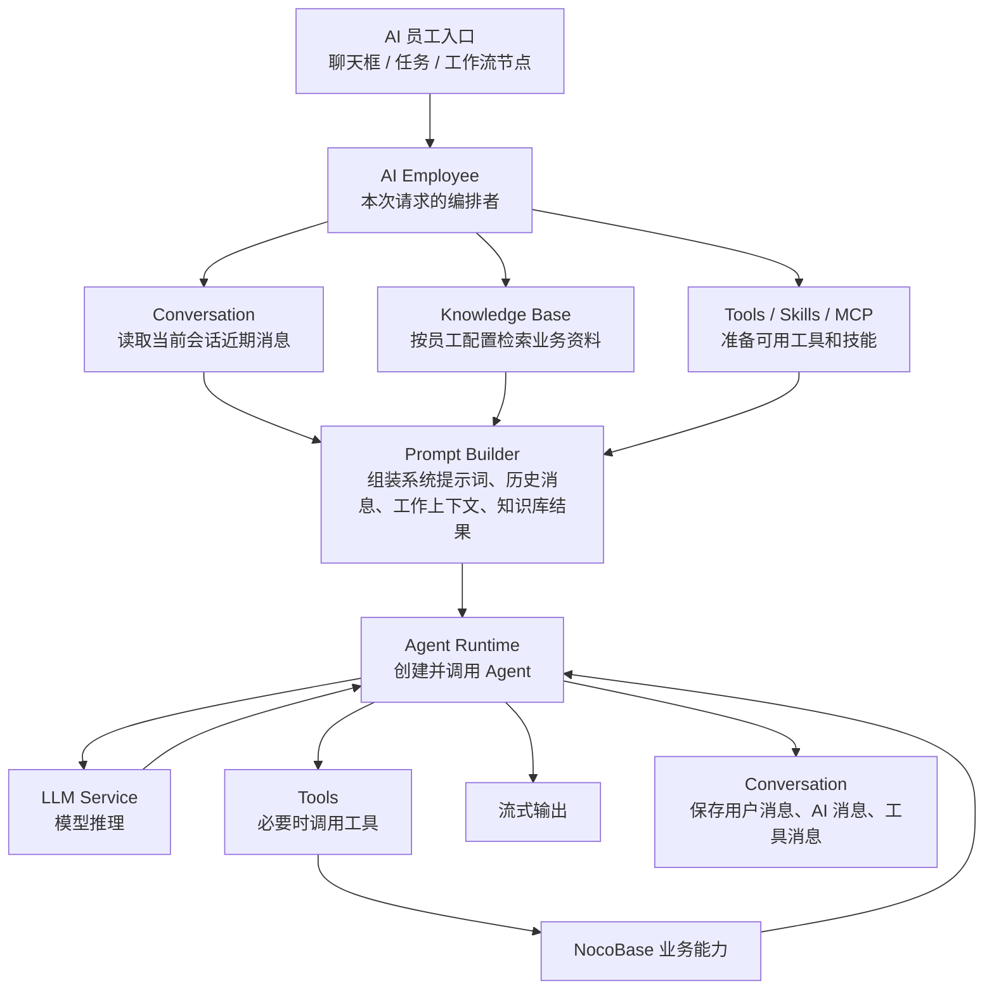

这里的关键关系是：

- Conversation 和 Prompt Builder 不是互相调用。
- AI Employee 是本次请求的编排者。
- AI Employee 先从 Conversation 读取历史消息，再把这些消息连同员工配置、工作上下文、知识库结果一起交给 Prompt Builder 组装。
- Agent Runtime 使用 Prompt Builder 组装好的上下文调用 LLM，并在过程中调用工具。
- 消息保存由 Agent Runtime 的会话中间件写回 Conversation。

从职责上看，当前 AI 员工可以拆成这些粗粒度模块：

| 模块 | 当前职责 |
| --- | --- |
| AI 员工配置 | 定义员工身份、昵称、头像、说明、系统提示词、模型、技能、工具、知识库配置和启用状态 |
| LLM 服务 | 管理不同模型服务与 provider，支持员工级专用模型配置 |
| 会话系统 | 保存 conversation、message、tool call、附件、工作上下文和会话状态 |
| Agent Runtime | 基于 LangChain / LangGraph 组织模型调用、工具调用、中断审批和状态恢复 |
| 工具系统 | 注册系统工具、自定义工具、MCP 工具、工作流工具，并处理工具权限 |
| 技能系统 | 让模型按需获取特定任务能力说明和配套工具 |
| 知识库系统 | 面向管理员维护的业务资料做 RAG 检索 |
| 工作流集成 | AI 员工可以作为工作流触发器或节点参与业务流程 |
| 权限系统 | 复用 NocoBase ACL、角色和用户关系控制员工可见性与工具能力 |

#### 2.1.2 当前一次对话的主链路

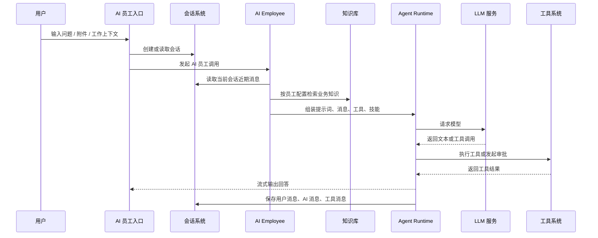

这个链路里，AI 员工的“上下文来源”主要有四类：

- 员工配置：角色、系统提示词、模型、工具、技能、知识库设置。
- 当前会话：近期用户消息、AI 回复、工具调用、附件、工作上下文。
- 业务系统：通过工具和工作流读取或操作 NocoBase 数据。
- 知识库：通过 RAG 获取管理员维护的业务资料。

#### 2.1.3 当前已有能力

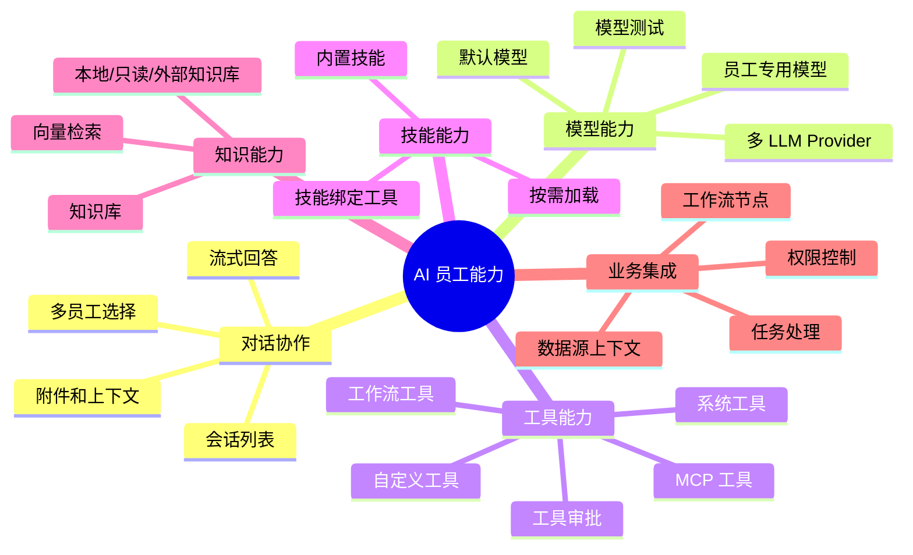

当前设计已经比较完整地覆盖了“AI 员工如何工作”和“AI 员工如何安全地调用业务能力”。但它对“AI 员工如何长期记住用户和业务”支持有限。

### 2.2 当前记忆相关设计

#### 2.2.1 现有三类“类记忆”能力

当前系统里有三类和记忆接近的设计，但它们分别解决不同问题。

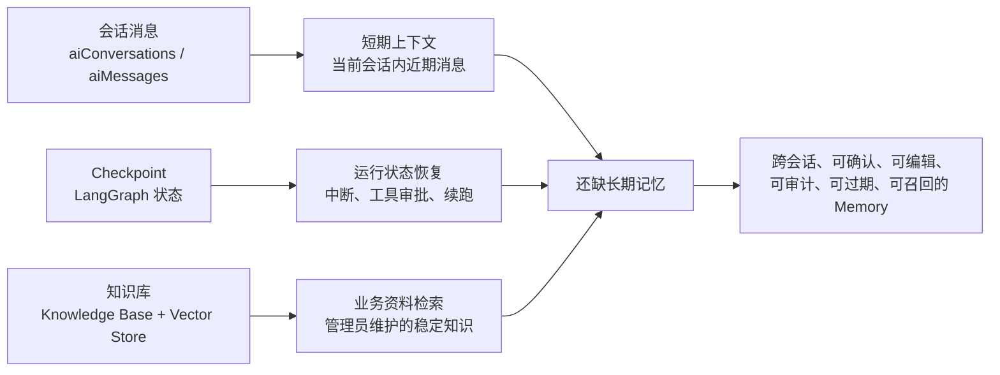

| 类型 | 保存什么 | 解决什么问题 | 为什么不是长期记忆 |
| --- | --- | --- | --- |
| 会话消息 | 用户消息、AI 回复、工具调用、附件、工作上下文 | 当前会话连续对话 | 只面向 session，读取近期消息；没有抽取、合并、淘汰、跨会话召回 |
| Checkpoint | LangGraph 运行状态、pending writes、channel values | 中断恢复、工具审批续跑 | 是运行时快照，会过期清理；不可读、不可管理、不可作为事实记忆 |
| 知识库 | 管理员维护的文档片段和向量索引 | RAG 检索业务资料 | 面向显式资料，不负责从交互中学习用户偏好或业务事实 |

#### 2.2.2 LangGraph 在项目中的使用

当前项目通过 LangChain / LangGraph 来组织 AI 员工的 Agent 运行过程。这里的 LangGraph 主要承担“Agent 执行状态管理”，而不是“业务长期记忆管理”。

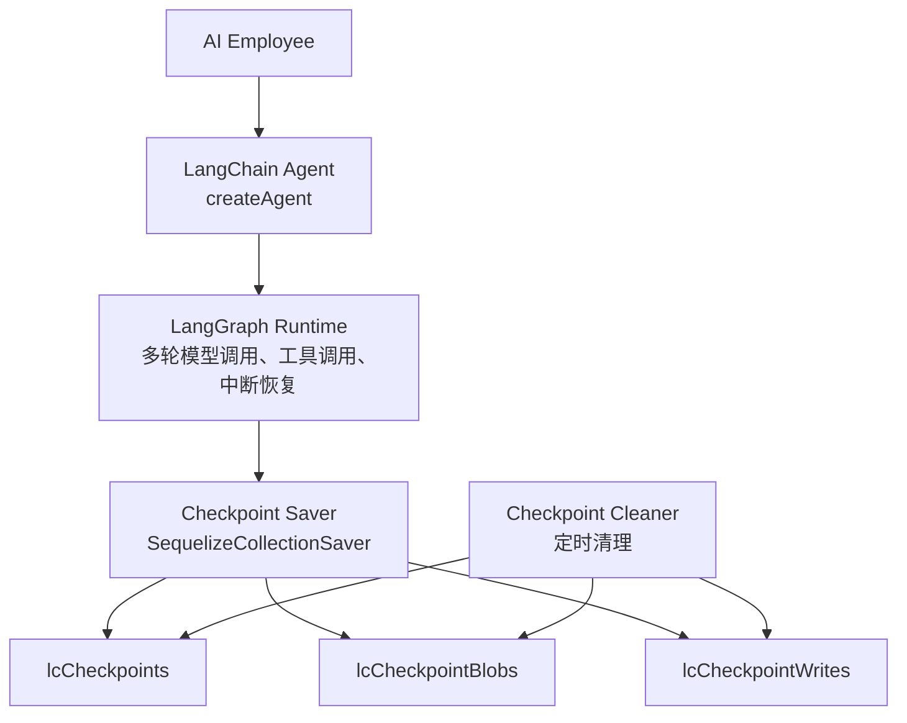

项目中的使用方式可以概括为：

- AI 员工创建 Agent 时，为 main-agent 挂载基于数据库的 checkpointer。
- 每个会话会有 thread id，用于把 LangGraph 的运行状态关联到当前 AI 会话。
- 当模型发起工具调用、工具调用需要用户审批、或者对话需要续跑时，LangGraph checkpoint 用来恢复执行状态。
- 系统会定时清理过期 checkpoint，避免运行状态长期堆积。

LangGraph 本身具备“状态持久化”和“线程级 checkpoint”能力，也可以被很多 Agent 框架用来实现短期记忆或会话状态恢复。但在当前项目中，它的作用边界是：

| 能力 | LangGraph 是否具备 | 当前项目是否使用 | 是否等同长期记忆 |
| --- | --- | --- | --- |
| 保存 Agent 运行状态 | 是 | 是 | 否 |
| 恢复中断执行 | 是 | 是 | 否 |
| 保存工具调用过程 | 是 | 是 | 否 |
| 保存当前会话的上下文状态 | 可以 | 部分使用，主要通过 checkpoint 和会话消息共同完成 | 否 |
| 跨会话长期记住用户偏好 | 不直接提供业务治理模型 | 未使用 | 否 |
| 记忆确认、编辑、审计、淘汰 | 不属于 LangGraph checkpoint 的职责 | 未使用 | 否 |

因此，LangGraph checkpoint 可以理解为“运行态记忆”或“执行状态记忆”，它回答的是：

- 上一次 Agent 执行到哪里了？
- 哪个工具调用还在等待？
- 用户审批后应该从哪个状态继续？

长期记忆要回答的是：

- 这个用户长期偏好什么？
- 这个 AI 员工在业务场景中应该长期记住什么经验？
- 哪些业务事实可以跨会话复用？
- 用户和管理员如何查看、确认、修改、删除这些记忆？

这两类问题不同，所以长期记忆不应直接建立在 LangGraph checkpoint 上，而应独立建模，再在 Agent 运行前作为上下文输入给 LangGraph / LLM。

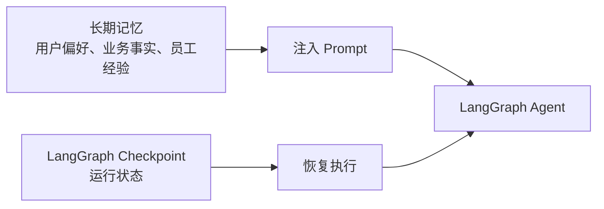

#### 2.2.3 当前记忆边界

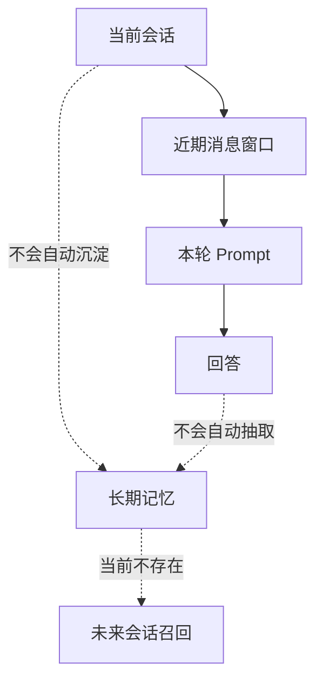

当前 AI 员工能“记住”的主要是：

- 当前会话近期上下文。
- 当前会话里已经加载过的技能和工具状态。
- 未完成工具调用或中断审批所需的运行状态。
- 员工配置中固定写入的提示词、知识库、模型和工具。

当前 AI 员工还不能稳定做到：

- 用户说过的偏好，下次新会话自动生效。
- 某个员工在多次交互中积累工作经验。
- 对业务事实做结构化沉淀、去重、合并和过期。
- 用户查看、编辑、确认或删除 AI 记住的信息。
- 根据权限和相关性跨会话召回记忆。

### 2.3 外部方案参考

长期记忆不是 coding agent 独有能力。更值得参考的是通用助手、陪伴类产品和专门的 agent memory 基础设施。不同类型产品对 memory 的侧重点不同：

- Coding agent 更关注“项目规则、用户偏好、工作目录上下文”。
- 通用助手更关注“个性化、来源可解释、用户可管理、隐私控制”。
- 陪伴类产品更关注“连续关系、人格一致性、情绪与身份延续”，但也带来更强的隐私和安全风险。
- Memory 基础设施更关注“抽取、存储、检索、更新、删除、评估、治理”。

#### 2.3.1 通用助手类

| 产品 | 记忆相关做法 | 对 NocoBase 的启发 |
| --- | --- | --- |
| ChatGPT Memory | 同时支持显式 saved memories 和 reference chat history；用户可开启/关闭、查看摘要、删除记忆、使用 Temporary Chat；回答里可以展示 memory sources；系统会自动更新、合并或降低旧记忆优先级 | NocoBase 需要区分“显式记忆”和“从历史中推断的记忆”；需要记忆来源、可解释、可删除、临时会话和管理员开关 |
| Google Gemini Saved Info / Personal Context | 用户可以让 Gemini 记住偏好，也可以查看、编辑、删除 saved info；Personal Context 类能力会从过去聊天中学习偏好，并提供临时聊天避免记忆 | 需要用户可控的记忆页；对一次性任务提供“不进入记忆”的临时模式；记忆使用时应提示或可追踪 |

#### 2.3.2 陪伴类 / 角色类产品

| 产品 | 记忆相关做法 | 对 NocoBase 的启发 |
| --- | --- | --- |
| Replika | 陪伴关系高度依赖长期互动、人格连续性和用户画像；公开资料显示用户会和 AI 形成持续关系，产品也因此面临隐私、安全和情感依赖风险 | 长期记忆会显著增强“连续性”和信任感，但业务系统必须避免过度拟人化和不可控情感依赖；需要明确边界、敏感信息策略和删除能力 |
| Character.AI / 角色聊天类 | 角色设定、示例对话、用户反馈共同塑造角色表现；核心价值是角色一致性和长期对话体验，但公开资料对底层长期记忆实现披露有限 | AI 员工也需要“角色一致性”，但更适合通过员工配置、员工级记忆、业务规则记忆实现，而不是无限制记住所有聊天细节 |

陪伴类产品的启发不是“照搬情感陪伴机制”，而是说明：长期记忆越强，用户越会期待 AI 有稳定身份和连续理解。因此 NocoBase 的 AI 员工长期记忆必须更重视治理：

- 用户知道 AI 记住了什么。
- 管理员知道员工级记忆从哪里来。
- 记忆错误时可以修正。
- 不该记的内容必须能快速忘记。

#### 2.3.3 Agent Memory 基础设施类

| 产品/框架 | 记忆相关做法 | 对 NocoBase 的启发 |
| --- | --- | --- |
| Mem0 | 定位为 AI agents 的 managed memory layer，强调跨用户和 agent 的持久记忆、减少 prompt 膨胀、托管向量存储/reranker、审计日志和 workspace governance；核心操作包括 add/search/update/delete | 记忆系统应提供标准 CRUD + 搜索能力；生产级能力需要审计、治理、metadata filter 和 workspace 管理 |
| Zep | 面向企业级 agent memory，把聊天、业务数据、文档、JSON 等来源构造成 temporal knowledge graph，再从 governed Context Lake 提供 token-efficient context | NocoBase 有大量结构化业务数据，长期记忆不应只做向量片段；中长期可考虑“记忆对象 + 关系/时间图谱”，支持时间推理和业务关系 |
| Letta / MemGPT | 强调 stateful agents。记忆被组织为 memory blocks，可被 agent 工具修改；重要 core memories 注入上下文；旧消息即使被压缩/逐出上下文仍保存在数据库并可检索；支持 shared memory blocks、archival memory | AI 员工可以借鉴“核心记忆 + 档案记忆”的分层；员工级共享记忆类似 shared memory blocks；记忆工具需要权限和 human-in-the-loop |
| LangGraph Memory | 区分 thread-scoped short-term memory 和跨 session 的 long-term memory；长期记忆可按 namespace/key 存为 JSON 文档，支持语义搜索；记忆写入可在 hot path 或 background | 当前项目已用 LangGraph checkpoint 做短期运行态恢复；长期记忆可以借鉴 namespace、semantic/episodic/procedural 分类和后台写入策略，但需要接入 NocoBase 权限与审计 |

#### 2.3.4 Coding Agent 类

| 产品/Agent | 记忆相关做法 | 对 NocoBase 的启发 |
| --- | --- | --- |
| Claude Code | 使用项目/用户级 `CLAUDE.md`，支持 `/memory` 和自动记忆确认 | 记忆需要分层，并且自动写入应可确认、可编辑 |
| Codex | 使用 `AGENTS.md` 作为项目规则，同时支持默认关闭的本地用户 memories | 项目规则和用户偏好要分开；默认关闭更符合隐私预期 |
| OpenCode | 更强调 `AGENTS.md`、规则和会话压缩 | 会话压缩不等于长期记忆，长期记忆需要独立治理 |

### 2.4 调研结论

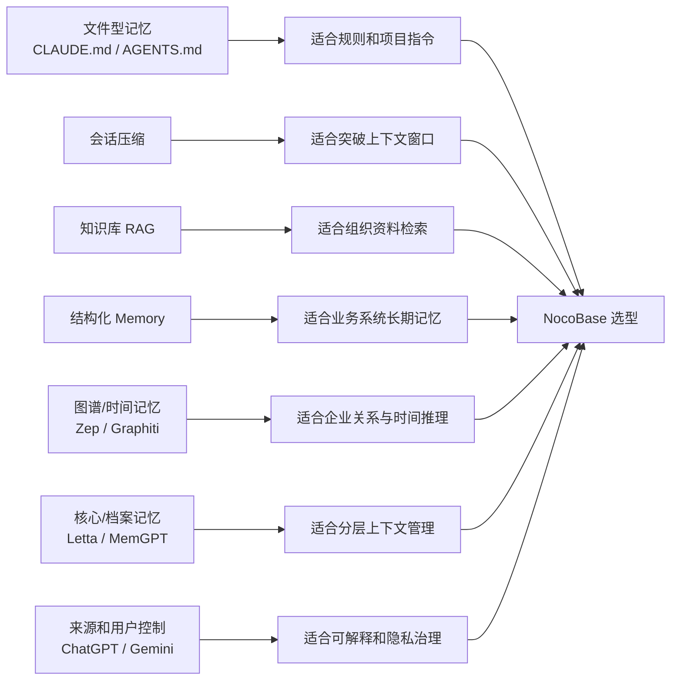

NocoBase 更适合采用“结构化 Memory + 向量召回 + 权限治理”的方案，因为 NocoBase 本身是业务系统平台，需要和用户、角色、业务数据、工作流和审计体系结合。

进一步的设计取舍：

- 第一阶段借鉴 ChatGPT / Gemini：显式记忆、用户可见、可删除、临时不记忆。
- 第一阶段借鉴 Mem0：标准化 add/search/update/delete，支持 metadata filter。
- 第二阶段借鉴 Letta：核心记忆和档案记忆分层，员工级共享记忆。
- 第三阶段借鉴 Zep：在企业场景中把记忆和业务实体、时间关系结合，支持更复杂的跨会话业务推理。
- 不照搬陪伴类产品的情感依赖设计，只借鉴“连续身份”和“长期上下文一致性”的产品价值。

## 3. 技术实现

### 3.1 长期记忆设计目标

长期记忆要解决的是“把交互中值得长期保留的信息，变成可治理的上下文资产”。

设计目标：

- 可分层：支持用户私有记忆、员工记忆、业务/工作区记忆。
- 可管理：用户和管理员可以查看、确认、编辑、归档、删除。
- 可追溯：每条记忆知道从哪里来、为何保存、何时被使用。
- 可检索：能根据当前问题、员工和业务上下文召回相关记忆。
- 可淘汰：过期、冲突、低价值或长期不用的记忆可以被归档或丢弃。
- 可控风险：默认不把敏感信息自动保存；自动记忆应可关闭或走确认。

不建议做的事：

- 不把完整聊天记录当长期记忆。
- 不把 checkpoint 当长期记忆。
- 不把知识库直接改造成用户记忆。
- 不让模型无约束地自动写入所有记忆。

### 3.2 长期记忆总体架构

#### 3.2.1 设计总览

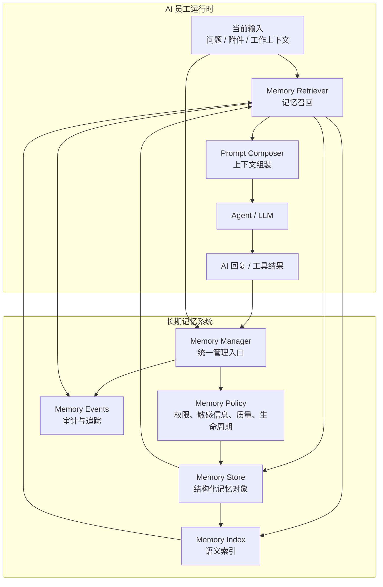

#### 3.2.2 模块关系

| 模块 | 职责 |
| --- | --- |
| Memory Manager | 长期记忆统一门面，负责创建、更新、检索、归档、删除和审计 |
| Memory Store | 结构化保存记忆对象，是长期记忆的权威数据源 |
| Memory Index | 保存可检索文本的向量索引，用于语义召回 |
| Memory Policy | 判断记忆能不能保存、谁能看、何时过期、如何合并和淘汰 |
| Memory Extractor | 从对话、工具结果或用户手动操作中提取候选记忆 |
| Memory Retriever | 在调用模型前按权限、相关性和预算召回记忆 |
| Memory UI | 用户和管理员查看、确认、编辑、删除记忆 |
| Memory Events | 记录记忆创建、更新、使用、归档、删除等事件 |

#### 3.2.3 与现有模块的关系

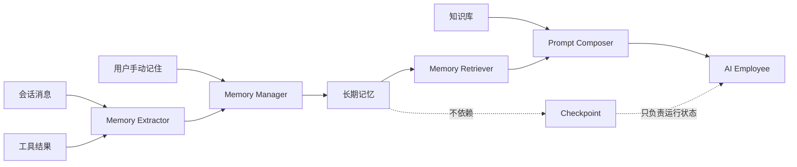

长期记忆和现有能力的边界：

- 会话消息是原始材料，长期记忆是抽取后的稳定信息。
- 知识库是组织资料，长期记忆是交互中沉淀的上下文。
- Checkpoint 是运行状态，长期记忆是可治理的事实和偏好。
- 工具系统可以读写记忆，但必须经过权限和用户确认策略。

### 3.3 长期记忆模型/结构

#### 3.3.1 记忆对象模型

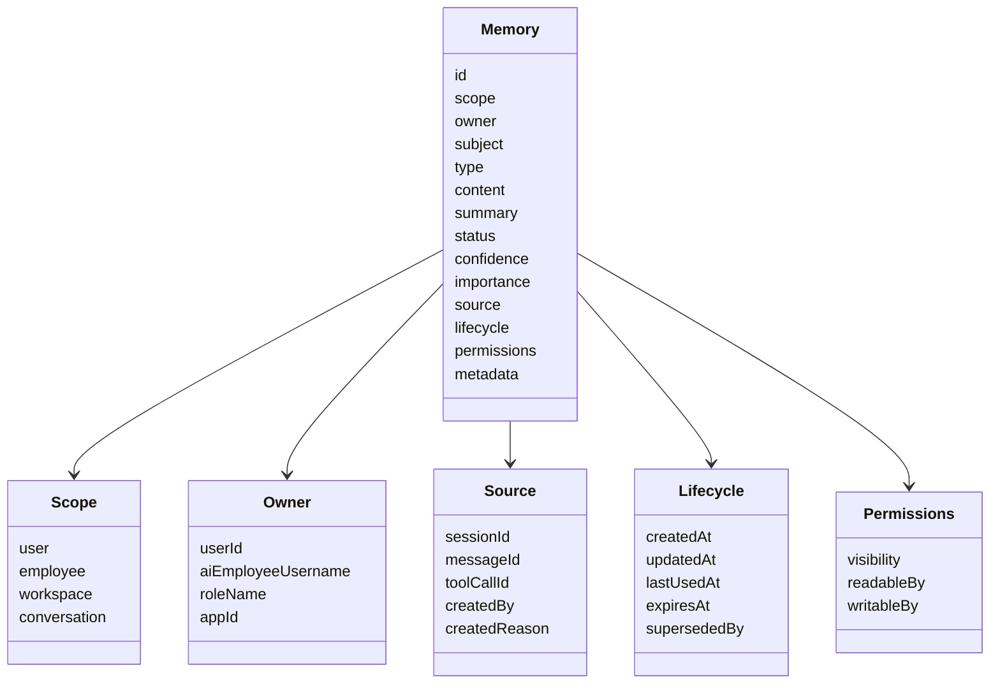

记忆对象不只是文本，而是带治理属性的对象。

| 维度 | 说明 | 示例 |
| --- | --- | --- |
| scope | 记忆作用范围 | 用户私有、员工共享、工作区共享、会话临时 |
| owner | 归属主体 | 某个用户、某个 AI 员工、某个角色或应用 |
| type | 记忆类型 | 用户偏好、业务事实、任务背景、工作习惯、禁忌偏好 |
| content | 可注入模型的自然语言内容 | “用户偏好中文技术方案，先给结论再展开。” |
| status | 生命周期状态 | 待确认、生效、拒绝、归档、过期 |
| confidence | 抽取置信度 | 0.86 |
| importance | 重要性 | 1 到 5 |
| source | 来源 | 来自哪次会话、哪条消息、哪个工具结果 |
| permissions | 权限 | 哪些用户、角色或员工可读写 |

#### 3.3.2 记忆分层

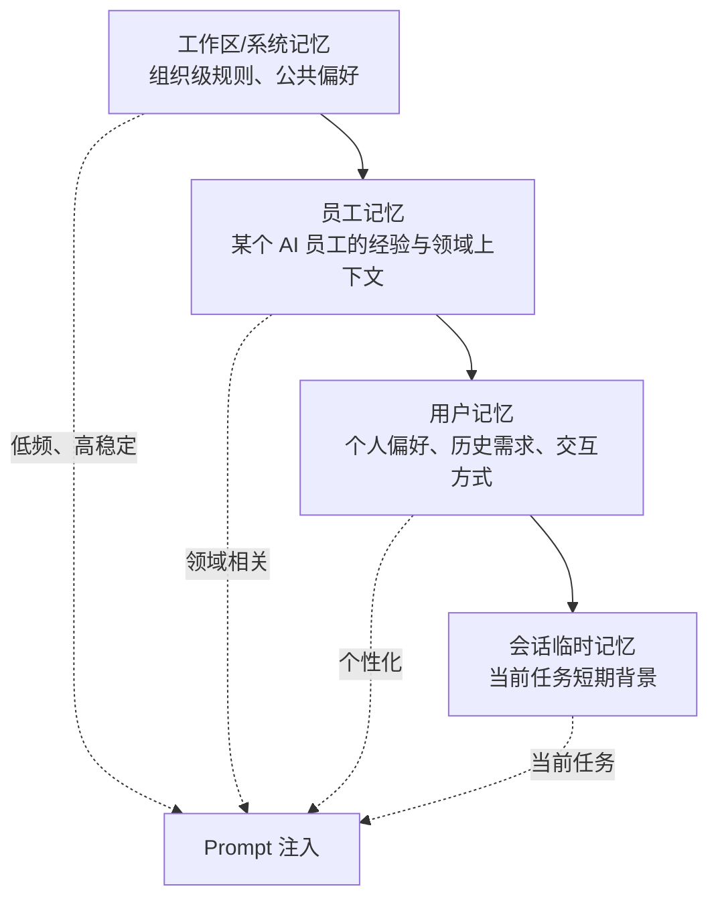

推荐优先支持：

1. 用户记忆：最直接提升体验，风险可由用户管理。
2. 员工记忆：让某个 AI 员工积累领域工作方式和固定业务上下文。
3. 会话临时记忆：用于长任务，但不作为第一阶段重点。
4. 工作区记忆：风险和治理成本最高，建议后置。

#### 3.3.3 记忆类型

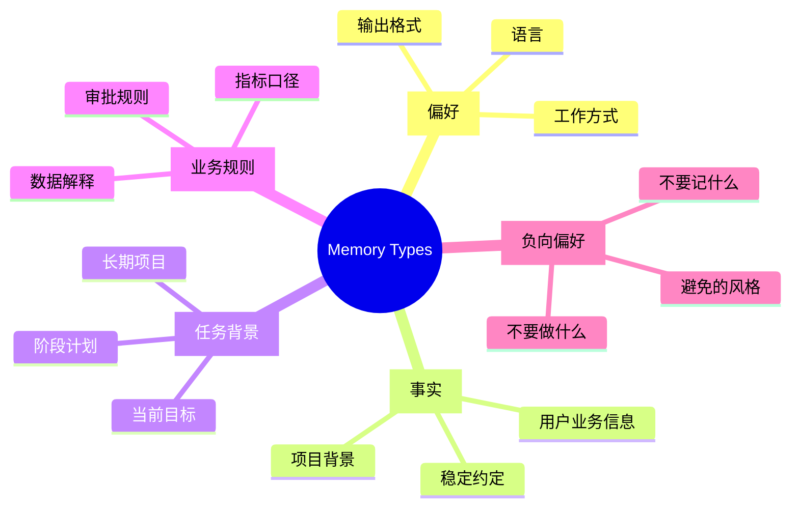

不同类型的记忆应有不同策略：

- 偏好类：适合长期保存，通常由用户确认。
- 事实类：需要较高置信度和来源追踪。
- 任务背景类：更容易过期，应设置生命周期。
- 业务规则类：更适合员工级或工作区级，建议管理员确认。
- 负向偏好类：优先级高，例如“不要记住我的手机号”。

### 3.4 长期记忆如何管理和存储

#### 3.4.1 存储设计

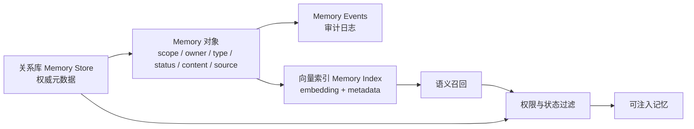

推荐采用“双层存储”：

- 关系库：保存记忆权威对象、权限、状态、来源、生命周期、审计信息。
- 向量索引：保存 active 记忆的可检索文本和必要过滤 metadata。

这样设计的原因：

- 仅有关系库不利于语义召回。
- 仅有向量库不利于权限、审计、生命周期和用户管理。
- 双层结构能复用现有知识库/向量能力，同时保持记忆对象可治理。

#### 3.4.2 管理入口

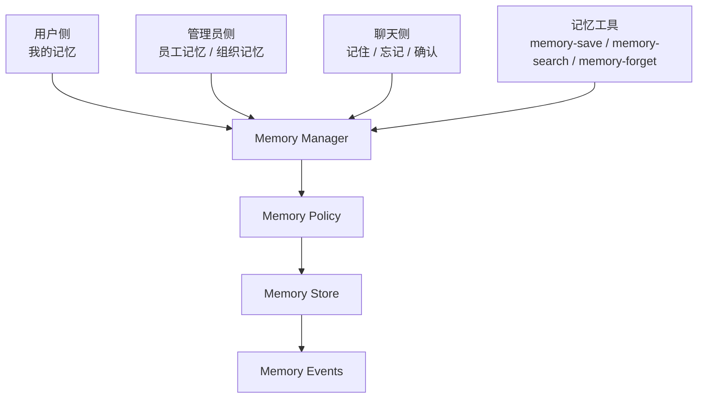

管理动作：

- 查看：按用户、员工、类型、状态筛选。
- 确认：把待确认记忆变成生效记忆。
- 编辑：修正文案、类型、范围、过期时间。
- 归档：不再使用，但保留记录。
- 删除：用户要求忘记时物理删除或按合规策略删除。
- 禁用：关闭某个员工的记忆读写能力。

#### 3.4.3 权限设计

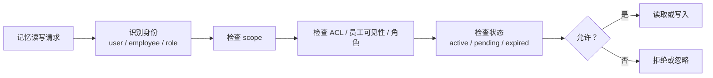

基本原则：

- 用户只能管理自己的用户记忆。
- AI 员工只能读取当前用户和当前员工都可见的记忆。
- 员工级记忆应由有权限的管理员管理。
- 工作区级记忆必须管理员确认。
- 待确认、拒绝、归档、过期的记忆默认不参与模型召回。

### 3.5 长期记忆如何增加、更新和丢弃

#### 3.5.1 增加记忆

记忆增加有三种入口：

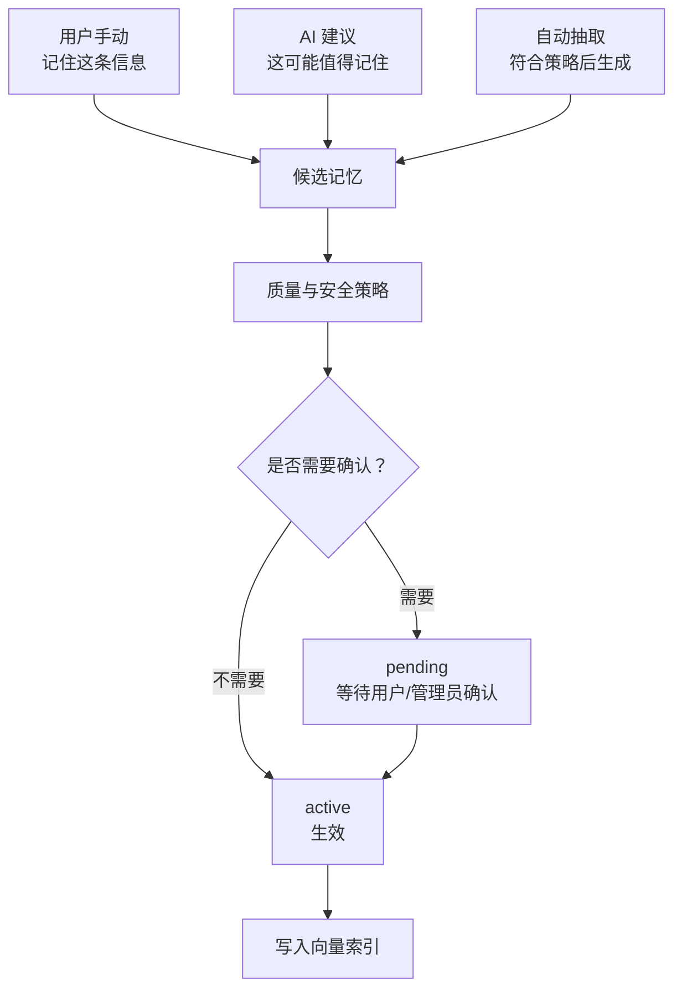

第一阶段推荐：

- 默认关闭自动记忆。
- 默认采用“AI 建议 + 用户确认”模式。
- 手动“记住此信息”立即生成候选记忆，由用户确认或编辑。

适合保存的内容：

- 用户明确表达的长期偏好。
- 多次出现的稳定工作方式。
- 对当前业务长期有效的背景事实。
- 员工执行任务时反复需要的业务口径。

不适合保存的内容：

- 一次性临时问题。
- 密码、token、API key、私钥。
- 高敏个人信息。
- 模型推测但用户没有确认的事实。
- 工具返回的大段原始数据。

#### 3.5.2 更新记忆

```mermaid
flowchart LR
  New["新候选记忆"] --> Similar["查找相似记忆"]
  Similar --> Decision{"关系判断"}
  Decision -->|重复| Drop["丢弃候选<br/>或增加来源"]
  Decision -->|补充| Merge["合并到旧记忆"]
  Decision -->|冲突| Supersede["新记忆替代旧记忆"]
  Decision -->|全新| Create["创建新记忆"]

  Merge --> Reindex["更新索引"]
  Supersede --> Reindex
  Create --> Reindex
```

更新规则：

- 重复：内容基本相同，不新增，只记录新的来源或使用次数。
- 补充：同一事实增加细节，合并成更完整的记忆。
- 冲突：新信息显著推翻旧信息，旧记忆归档或标记为被替代。
- 过期刷新：同一任务背景再次被提到，可以延长过期时间。

#### 3.5.3 丢弃记忆

```mermaid
stateDiagram-v2
  [*] --> Pending: 生成候选
  Pending --> Active: 用户/管理员确认
  Pending --> Rejected: 拒绝
  Active --> Archived: 手动归档
  Active --> Expired: 到期
  Active --> Superseded: 被新记忆替代
  Archived --> Deleted: 删除
  Expired --> Deleted: 清理
  Rejected --> Deleted: 清理
  Superseded --> Deleted: 清理
```

丢弃触发：

- 用户说“忘记这件事”。
- 用户或管理员手动删除。
- 到达过期时间。
- 与新记忆冲突，被替代。
- 长期未使用且重要性低。
- 超过用户或员工记忆配额。
- 被策略识别为敏感或低质量。

推荐采用“先归档/过期，后清理”的方式，除非用户明确要求删除。

## 4. 使用流程

### 4.1 对话中使用长期记忆

```mermaid
sequenceDiagram
  participant U as 用户
  participant E as AI Employee
  participant R as Memory Retriever
  participant S as Memory Store
  participant V as Memory Index
  participant P as Prompt Composer
  participant L as LLM

  U->>E: 发起新问题
  E->>R: 请求相关长期记忆
  R->>S: 按用户、员工、scope、状态过滤
  R->>V: 语义检索相关记忆
  V-->>R: 返回候选
  S-->>R: 返回可见性和生命周期信息
  R->>R: 排序、去重、预算控制
  R-->>P: 返回可注入记忆
  P->>L: 当前问题 + 会话上下文 + 长期记忆 + 知识库
  L-->>E: 生成回答或工具调用
  E-->>U: 返回结果
  R->>S: 记录记忆被使用
```

### 4.2 注入位置

长期记忆应作为独立上下文块注入，而不是混在聊天历史里。

```mermaid
flowchart TB
  System["系统提示词<br/>员工身份、规则、安全边界"] --> Prompt["最终 Prompt"]
  WorkContext["当前工作上下文<br/>页面、数据、附件"] --> Prompt
  Recent["当前会话近期消息"] --> Prompt
  Memory["长期记忆<br/>相关偏好、事实、业务背景"] --> Prompt
  KB["知识库检索结果<br/>业务资料片段"] --> Prompt
  Tools["工具和技能说明"] --> Prompt
```

推荐注入格式：

```xml
<long_term_memory>
- 用户偏好使用中文进行技术方案讨论，并希望先给结论。
- 在 CRM 分析场景中，高意向客户指线索评分大于 80。
</long_term_memory>
```

### 4.3 召回排序

```mermaid
flowchart LR
  Candidate["候选记忆"] --> Semantic["语义相关性"]
  Candidate --> Permission["权限可见性"]
  Candidate --> Freshness["时效性"]
  Candidate --> Importance["重要性"]
  Candidate --> Usage["历史使用情况"]

  Semantic --> Rank["综合排序"]
  Permission --> Rank
  Freshness --> Rank
  Importance --> Rank
  Usage --> Rank
  Rank --> Budget["Token 预算裁剪"]
  Budget --> Inject["注入 Prompt"]
```

排序因素：

- 当前问题是否语义相关。
- 当前用户和员工是否有权限读取。
- 记忆是否过期。
- 记忆重要性和置信度。
- 最近是否使用过。
- 与知识库和当前会话上下文是否重复。

### 4.4 与知识库一起使用

```mermaid
flowchart TB
  Query["当前问题"] --> MemorySearch["长期记忆检索"]
  Query --> KBSearch["知识库检索"]

  MemorySearch --> MemoryResult["个性化/员工经验<br/>偏好、上下文、历史约定"]
  KBSearch --> KBResult["组织资料<br/>文档、流程、制度、知识片段"]

  MemoryResult --> Compose["上下文组装"]
  KBResult --> Compose
  Compose --> LLM["模型回答"]
```

区别：

- 长期记忆回答“这个用户/员工/任务过去有什么稳定上下文”。
- 知识库回答“组织已有资料里有什么事实依据”。

二者可以同时使用，但应分区注入，避免模型混淆来源。

### 4.5 用户主动管理记忆的流程

```mermaid
sequenceDiagram
  participant U as 用户
  participant UI as 记忆管理界面
  participant M as Memory Manager
  participant P as Memory Policy
  participant S as Memory Store

  U->>UI: 查看我的记忆
  UI->>M: 查询当前用户可管理的记忆
  M->>P: 校验权限和范围
  P-->>M: 返回可见记忆范围
  M->>S: 读取记忆列表
  S-->>UI: 返回记忆
  U->>UI: 确认 / 编辑 / 归档 / 删除
  UI->>M: 提交操作
  M->>P: 校验操作权限
  M->>S: 更新记忆状态
```

## 5. 主要界面

### 5.1 用户侧：我的记忆

用于普通用户查看和管理 AI 员工记住的个人信息。

```mermaid
flowchart TB
  Page["我的记忆"] --> Filter["筛选<br/>类型 / 员工 / 状态 / 来源"]
  Page --> List["记忆列表"]
  List --> Detail["记忆详情<br/>内容、来源、最近使用、置信度"]
  Detail --> Actions["操作<br/>确认 / 编辑 / 归档 / 删除"]
```

主要信息：

- 记忆内容。
- 记忆类型。
- 来源会话或来源消息。
- 适用 AI 员工。
- 状态：待确认、生效、归档、过期。
- 最近使用时间。

### 5.2 聊天侧：记住与忘记

用于在对话过程中轻量管理记忆。

```mermaid
flowchart LR
  Message["聊天消息"] --> Remember["记住此信息"]
  Message --> Forget["忘记相关记忆"]
  AIHint["AI 建议保存"] --> Confirm["用户确认"]
  Confirm --> Active["记忆生效"]
```

主要交互：

- 用户在消息上点击“记住此信息”。
- AI 建议“是否记住这个偏好/事实”。
- 用户要求“忘记这件事”时触发相关记忆查找和删除确认。

### 5.3 管理员侧：AI 员工记忆设置

用于配置某个 AI 员工是否启用长期记忆、能读写哪些范围、是否需要确认。

```mermaid
flowchart TB
  Admin["AI 员工设置"] --> Switch["长期记忆开关"]
  Admin --> Mode["保存模式<br/>关闭 / 建议保存 / 自动保存"]
  Admin --> Scope["可读写范围<br/>用户 / 员工 / 工作区"]
  Admin --> Policy["策略<br/>确认、过期、配额、敏感信息"]
  Admin --> Memories["员工记忆列表"]
```

### 5.4 管理员侧：组织记忆治理

用于中大型公司治理员工级和组织级记忆。

主要能力：

- 查看全局记忆概览。
- 按员工、角色、业务线查看记忆。
- 审批员工级或组织级记忆。
- 设置保留策略、配额、敏感信息规则。
- 查看记忆使用审计。

## 6. 推荐建设路径

### 阶段 1：可确认的用户长期记忆

目标：让用户能明确知道 AI 记住了什么，并能管理。

范围：

- 用户级记忆。
- 手动保存和 AI 建议保存。
- pending / active / archived / deleted 生命周期。
- 对话前召回 active 记忆。
- 用户侧“我的记忆”管理入口。

### 阶段 2：员工级记忆和自动抽取

目标：让特定 AI 员工积累领域经验，但仍可治理。

范围：

- 员工级记忆。
- 自动抽取候选记忆。
- 管理员确认员工级记忆。
- 去重、合并、替代、过期。
- 记忆使用审计。

### 阶段 3：组织级记忆和策略治理

目标：把长期记忆纳入组织级治理。

范围：

- 工作区级记忆。
- 配额和淘汰策略。
- 敏感信息策略。
- 记忆导出、批量删除和合规保留。
- MCP / 外部 Agent 的记忆访问能力。

## 7. 关键风险

| 风险 | 说明 | 缓解 |
| --- | --- | --- |
| 错误记忆污染回答 | 模型错误抽取或误解用户意图 | 默认确认后生效；展示来源；支持编辑删除 |
| 隐私泄露 | 保存了不该保存的个人或业务敏感信息 | 默认关闭自动记忆；敏感信息过滤；权限隔离 |
| 记忆过多 | 召回噪声大、prompt 膨胀 | 重要性、过期、配额、预算裁剪 |
| 权限越界 | 员工读到不该读的用户或业务记忆 | Store 和 Index 双层过滤；ACL 校验 |
| 与知识库混淆 | 模型分不清个人偏好和组织知识 | 分区注入；不同对象模型和管理入口 |
| 自动写入失控 | 对话越多，低质量记忆越多 | 建议保存优先；自动抽取后置；淘汰机制 |

## 8. 验证结论

### 8.1 是否结合 NocoBase 业务场景

是。方案已经把长期记忆放在 NocoBase 的数据、权限、工作流、知识库、页面上下文和 AI 员工体系中设计，而不是作为独立聊天机器人的记忆功能。它覆盖 CRM、工单、审批、数据分析、项目管理、本地化等典型业务系统场景。

### 8.2 是否适配不同规模公司

是。方案通过 `scope` 和治理能力分层适配不同规模：

- 小团队：只启用用户私有记忆和手动/建议保存。
- 中型公司：增加员工级记忆和管理员确认。
- 大型组织：增加组织级记忆、审计、配额、过期、合规保留和敏感信息策略。

### 8.3 是否包含要求章节

| 要求章节 | 文档位置 | 是否覆盖 |
| --- | --- | --- |
| 0. 需求主题 | `0. 需求主题` | 是 |
| 1. 需求背景 | `1. 需求背景` | 是 |
| 2. 方案调研 | `2. 方案调研` | 是 |
| 3. 技术实现 | `3. 技术实现` | 是 |
| 4. 使用流程 | `4. 使用流程` | 是 |
| 5. 主要界面 | `5. 主要界面` | 是 |

## 9. 总结

AI 员工当前已经具备短期会话上下文、运行状态恢复和知识库检索，但这些能力都不是完整长期记忆。长期记忆应作为独立域模型建设，围绕 Memory 对象提供保存、确认、检索、注入、更新、归档、删除和审计能力。

推荐的长期记忆架构是：

```mermaid
flowchart LR
  Source["对话 / 工具 / 用户手动"] --> Extract["抽取候选记忆"]
  Extract --> Govern["确认与治理"]
  Govern --> Store["结构化存储"]
  Store --> Index["向量索引"]
  Index --> Retrieve["按权限召回"]
  Store --> Retrieve
  Retrieve --> Use["注入 AI 员工上下文"]
  Use --> Improve["提升跨会话协作"]
```

这个方案能与当前 AI 员工架构自然结合，同时保持长期记忆可解释、可管理、可审计、可淘汰。

## 10. 参考文献

### 10.1 通用助手类

1. OpenAI Help Center: ChatGPT Memory FAQ  
   https://help.openai.com/en/articles/8590148-memory-faq
2. Google Gemini Apps Help: Manage your Saved info  
   https://support.google.com/gemini/answer/16012603
3. The Verge: Google's Gemini chatbot can now remember things about you  
   https://www.theverge.com/2024/11/19/24300709/google-gemini-chatbot-memory

### 10.2 陪伴类 / 角色类产品

1. Replika official site  
   https://replika.com/
2. Wikipedia: Replika  
   https://en.wikipedia.org/wiki/Replika
3. Character.AI official site  
   https://character.ai/

### 10.3 Agent Memory 基础设施类

1. Mem0 Documentation: Overview  
   https://docs.mem0.ai/platform/overview
2. Zep Documentation: Overview  
   https://help.getzep.com/overview
3. Letta Documentation: Stateful agents  
   https://docs.letta.com/guides/core-concepts/stateful-agents
4. LangChain Documentation: Memory  
   https://docs.langchain.com/oss/python/concepts/memory

### 10.4 Coding Agent 类

1. Anthropic Documentation: Claude Code Memory  
   https://docs.anthropic.com/en/docs/claude-code/memory
2. OpenAI Developers: Codex AGENTS.md  
   https://developers.openai.com/codex/guides/agents-md
3. OpenAI Developers: Codex CLI  
   https://developers.openai.com/codex/cli/
4. OpenCode Documentation: Agents  
   https://opencode.ai/docs/agents/
